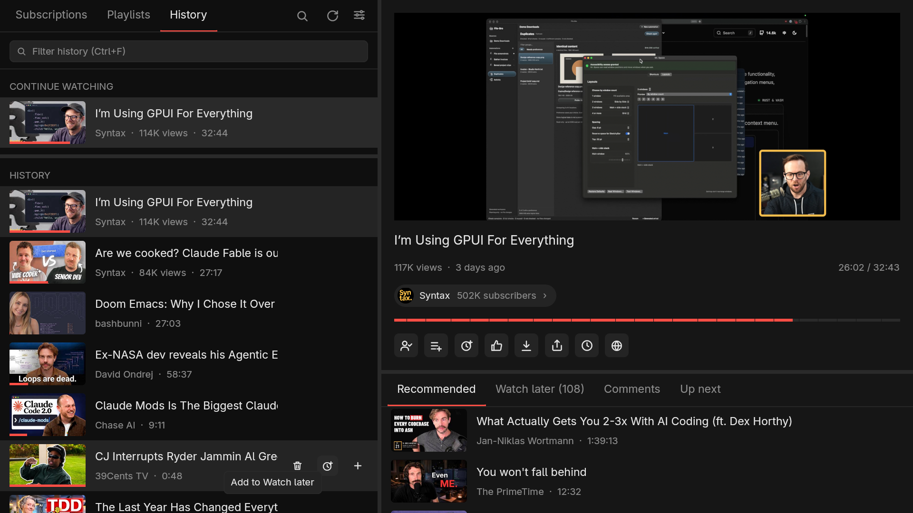

# UnbloatedTube

[](https://github.com/antlis/UnbloatedTube/releases/latest)
[](https://github.com/antlis/UnbloatedTube/releases)


> **Alpha software.** It works day to day for its author, but it is young: expect rough edges, bugs
> and changes between versions (settings, shortcuts and files may change). Linux/X11 only for now.
> Bug reports and feedback are welcome.

A lightweight, configurable YouTube desktop client, written in Rust with
[GPUI](https://crates.io/crates/gpui) (the UI framework behind the Zed editor), with
[mpv](https://mpv.io) for playback and [yt-dlp](https://github.com/yt-dlp/yt-dlp) for data.

It is **keyboard-driven**: playback, lists, tabs, panes and column layout all have shortcuts;
`Tab` moves a visible focus ring through every button, row and switch (`Enter` presses it); and an
optional Vim mode adds Vimium-style [hint mode](#vim-mode) to click anything without the mouse.

> **Renamed in 0.34.0** from *unbloated-youtube*. The command is now `unbloatedtube` (or `ubt`);
> `unbloated-youtube` still works as an alias. Settings, history, downloads and caches move to
> the new folders by themselves on first start. Arch: the package is now `unbloatedtube-bin`,
> and `unbloated-youtube-bin` moves you over on the next upgrade. Nix: the flake output is
> `unbloatedtube` (`unbloated-youtube` stays as an alias).



## Why

I wanted YouTube as **its own app**, so that YouTube tabs stop piling up in my browser, and
with a UI that does what I need and nothing else.

The YouTube web UI gets in the way of the basics:

- **Playlists are hard to manage.** Adding a video to a playlist opens a small popup with no
  search, so with many playlists you scroll and hunt. Seeing a playlist's contents, or
  removing a video, is several clicks deep.
- **Subscriptions are buried.** The channel list is tucked away in a sidebar or a separate
  page, and the subscriptions feed mixes everything into one endless scroll.
- **Shorts everywhere.** I'm usually not interested in them, and the web UI keeps pushing them.
- **Recommendations and ads.** The home page is a recommendation feed, and videos have
  sponsor reads in them.

So here most things can be turned off in Settings: Shorts, recommendations, whole tabs, every
button under the player, and sponsor segments (via SponsorBlock). What's left is a channel
list, your playlists, your history, search and a player.

## Features

### Browsing

- **Subscriptions as a channel list**: avatars, A–Z, with channels that have new uploads on
  top with an unseen count. Click a channel for its videos (**Videos | Shorts | Live** tabs).
- **Live tab in Subscriptions**: **Channels | Live (N)** at the top; Live lists the streams that are
  on now from your subscriptions (the group chips narrow it), each with a red LIVE badge.
- **Unsubscribe from the list**: right-click a channel, then confirm with a second click.
- **New uploads**: one feed of the latest videos from all your subscriptions.
- **Channel groups**: put channels into groups (e.g. *Music*, *Tech*) and filter the channel
  list and the New uploads feed by group. Right-click a channel to tick the groups it belongs to;
  a folder icon in the list marks channels that are in a group (hover for the names). Groups are
  kept only in this app (`groups.json` in the data folder), not on YouTube.
- **Mute a channel**: hide its uploads from New uploads without unsubscribing.
- **Hide videos by keyword**: Settings → Hide videos with words takes comma-separated words or
  phrases (`reaction, prank, #shorts`); a video whose title says one, as a word of its own
  ("art" hides "Art school", not "start"; list "reactions" too if you want both), is hidden from
  feeds, channels, recommendations, Live and search, and gets no upload notification. Your own
  lists (History, Up next, Watch later, Downloads, your playlists) are left alone.
- **Upload notifications**: turn the bell on in a channel's header to get a desktop
  notification when it uploads (checked every 5–60 minutes, configurable).
- **Playlists**: Watch later, Liked videos and your own playlists, loaded in full.
- **History**: *Continue watching* (started but not finished, resizable with a drag bar), then
  your YouTube history in YouTube's own order, each entry with the day you watched it
  ("Today", "Saturday", …), then what only this app has seen. With Shorts on, Videos and
  Shorts have their own tabs.
- **Search**: a search mode with recent searches. Nothing is sent to YouTube until you press
  Enter.
- **Play a YouTube link**: paste it into search and press Enter, or press Ctrl+V anywhere
  outside a text field to play the link on the clipboard. Understands `watch?v=`, `youtu.be/`,
  `/shorts/`, `/live/` and `/embed/` links, with a start time from `t=` (`90`, `1m30s`). Channel
  links (`/@handle`, `/channel/UC…`, `/c/…`, `/user/…`) and playlist links (`/playlist?list=`)
  open that channel or playlist in the left column.
- **Cast**: a button (and **T**) sends the playing video to another device by running a command you
  set up per target in `config.toml`, for example a TV box running mpv ([see below](#cast-targets)).
- **Subtitles**: a CC button next to the player's other buttons (or **V**) turns them on and
  off for the playing video; the first click turns subtitles on. Settings → Subtitles has the
  on/off switch, the language (or several, `en,ru`; empty uses your system language), whether
  YouTube's auto-generated and auto-translated captions count, and the size. The captions are
  downloaded with yt-dlp (and cached for two weeks), because YouTube refuses to serve them to mpv
  itself. Auto-generated captions are rewritten into short phrases that follow the speech
  (YouTube's own file scrolls two lines and shows words early). For some videos YouTube also refuses yt-dlp without a login: Connect YouTube for those.
- **Filter any list as you type** (Ctrl+F): channels, playlists, a channel's or playlist's
  videos, history. This is local and instant, with no request to YouTube.
- **Video info**: views, upload date and subscriber count for the playing video (needs your login),
  view counts in lists that provide them, subscriber counts in the channel list. Each is a Settings toggle.
- Watched videos are dimmed, and partly watched ones show a progress bar on the thumbnail.
- Lists appear instantly from a local cache and refresh in the background; long lists stream
  in as yt-dlp produces them.

### Playlists done right

- **Save to playlist** opens a full-height picker **with search**: type a few letters, press
  Enter. It lists the playlists you can add to (what YouTube's own Save menu offers) and Watch
  later, not the ones you only saved from other people; those stay in the Playlists tab.
- **Remove from playlist**: hover a video in an open playlist and click the trash icon (in
  Liked videos this unlikes it). It removes that one entry; if the video is in the playlist
  several times, the first copy goes.
- **Add a whole playlist to Up next** with one button in the playlist header.
- **Right-click any video** (Recommended, History, a channel's videos, New uploads, Up next, Watch
  later, search results): **Copy link**, **Add to Up next** (or remove it), **Save to Watch later**,
  and below a divider your own playlists in a scrolling list (the ones YouTube's Save menu offers),
  ticked where the video already is; click one to add the video, or a ticked one to remove it.
  On the playing video the same menu also has copy link at the current time, loop, speed, subtitles,
  stats for nerds and open in browser (the video is replaced by its thumbnail while it is open).
  Logged out you get Copy link and Up next only. Escape or a click elsewhere closes it.
- A notice confirms every action (or says why YouTube refused it, e.g. for playlists you
  saved from someone else, which you can't edit).

### Player

- mpv **embedded in the window**, with seek bar, chapters (hover for title and time), time
  display, prev/next, ±10 s, fullscreen and speed.
- Opens on **the last video you watched, at the position you left it**; every video resumes
  where you stopped.
- **Up next** queue (add with the `+` on any row); otherwise Next/autoplay continues through the
  list you picked the video from. When Next takes a video from Up next, a notice says so (and
  the Next button's tooltip names it).
  Playing a whole playlist (the **Play** icon in its header, or right-click, **Play**) empties
  Up next first, so Next follows the playlist.
- **Picture-in-picture**: move playback into a small always-on-top mpv window and keep
  browsing.
- **Volume**: mute button and a volume bar next to the speed button, or `↑`/`↓` (`+`/`-` in Vim
  mode), also while the pointer is over the video. Remembered between runs.
- **Chapters tab** under the player for videos that have chapters: click one to jump there; the
  current chapter is highlighted and kept in view.
- **Description tab** under the player (Settings → Description turns it off): the video's
  description, fetched when you open the tab. Timestamps in it (`12:34`, `1:02:03`) jump the
  video there, `#tags` are searched for, `@handles` and YouTube links open in the app, and other
  links in the browser; the same works in comments.
- **Likes and dislikes** of the playing video in the line under its title ("412 likes · 23
  dislikes"), from the [Return YouTube Dislike](https://returnyoutubedislike.com) project: YouTube
  hides dislikes, so the number is the project's estimate. Works logged out too. The request
  tells the project which video you watch; Settings → Likes and dislikes turns it off.
- **Better titles and thumbnails (DeArrow)**, off by default: titles and thumbnails the
  community wrote to replace clickbait ones, from the [DeArrow](https://dearrow.ajay.app) project
  (by the SponsorBlock authors). Settings → DeArrow turns titles and thumbnails on separately. A
  replaced title shows YouTube's own when you hover it in a list, and under it on the player.
  Only what is on screen is asked for, by the first 4 hex digits of the SHA-256 of the video id
  (as the browser extension does), so DeArrow doesn't learn which video; without a submission,
  or when DeArrow can't be reached, YouTube's title and thumbnail stay.
- **Subtitle language picker**: right-click the video → Subtitles: … lists the video's own
  caption tracks, its auto-generated one, and auto-translations into your languages (Settings →
  Subtitle language); a pick shows those captions at once, for this video only, and the
  Transcript tab follows it. Off hides them.
- **Sleep timer**: right-click the video → Sleep: Off, End of this video, or 15 to 90 minutes.
  When the time is up the video pauses (the receiver too while casting); "End of this video"
  lets it finish without autoplay or Up next starting another. The corner shows what it waits
  for ("Sleep in 23 min"); the same menu turns it off.
- **Quality picker**: right-click the video → Quality: 1080p shows the playing quality and a
  list (Auto, 2160p … 144p, Audio only); a pick reloads the video at once from where it was, for
  this video only (the next one plays at Settings → Max quality again). A height is a maximum:
  a video without it plays the best below. Not for downloaded files or while casting.
- **Transcript tab** under the player: the video's captions as a list of lines with their times,
  the one being said highlighted. Type a word in its search field to see every moment it is
  said (the word is marked, with a count); click a line to jump there. It uses the same captions
  as the subtitles (Settings → Subtitles: languages, auto-generated captions) and the same
  cache, so it is instant for a video whose subtitles you had on. Settings → Transcript hides it.
- **Downloads tab**: videos saved with the Download button, newest first, with a filter. They
  play from the file, so also offline (and logged out). Right-click → "Delete downloaded file"
  deletes it; a file deleted or moved outside the app drops off the list. The tab shows once
  something is downloaded (Settings → Downloads tab hides it).
- **Comments tab** under the player, off by default (Settings → Comments): the top 40 comments are
  fetched only when you open the tab, and "Load more comments" at the bottom gets 40 more.
- **Resizable player**: drag the divider between the video and the lower pane anywhere, up to
  the top; `E` gives the lower pane the whole right column and back; `⇧E` does the same for the player. The left column collapses too
  (`B`, or drag its divider to the edge), and so does the right one (`⇧B`, or drag the divider
  to the right edge).
- **Hover controls**: move the pointer over the video and a YouTube-style bar appears: a seek
  line, then play/pause, previous/next, mute and volume and the time on the left, and ±10 s,
  subtitles (CC: filled while they show, like V), speed, picture-in-picture and fullscreen on the
  right. The CC button under the player then only shows where the bar can't be used (hover
  controls off, picture-in-picture, casting); both follow Settings → Player buttons → Subtitles. It hides itself after a moment. With it on, the
  row of playback buttons under the video is gone and only the account/action buttons remain; with
  it off (Settings, *Hover controls on the video*) you get the two button rows instead. The bar is
  drawn by mpv from a small bundled script, since the video is a separate native window the app
  can't draw over.
- **No mpv chrome by default**: mpv's own on-screen controls and key bindings are switched off
  over the video, so the app's shortcuts work there too. Turn them back on in Settings (*mpv
  controls and hotkeys*) if you want mpv's `osc`, wheel volume, `s` for screenshots and so on.
- Click the video to pause, double-click for fullscreen. The app's own shortcuts work with the
  pointer over the video too, since mpv's key bindings are off by default.
- **Recommendations** under the player (your YouTube home feed), or turn them off.
- **Watch later tab** under the player (off by default, Settings → Watch later tab): your Watch
  later list, loaded when you open the tab, with a remove button on each row.

### Account actions

Subscribe/unsubscribe, save to playlist, Watch later (one click, `W`; also on every video row), like, dislike, copy link (also at the current time), open in browser and download, all as
icon buttons with tooltips. Each one can be hidden in Settings (like and dislike are hidden by
default).

### Settings

Everything is a toggle or a field on the Settings page, which has its own search box:

| Group | Options |
| --- | --- |
| Account | **Connect YouTube**: pick a browser and test its session, or import a `cookies.txt` (see [Login](#login)) |
| Tabs & lists | Subscriptions, Playlists, History, Downloads, Recommendations, Description, Transcript, Chapters, Comments and Watch later tabs (the last two off by default), **Shorts** (everywhere) |
| Buttons | Back / forward, Subscribe, Save to playlist, Watch later, Like, Dislike, Volume, Subtitles, Cast, Share, Share at current time, Open in browser, Download |
| Subtitles | On/off, language(s), auto-generated captions, size |
| Player | Max quality (480p–4K), autoplay, **audio only**, prefer hardware-friendly codecs (skip AV1), hardware decoding, hover controls on the video, mpv's own controls and hotkeys, speed |
| SponsorBlock | **Skip sponsored segments**, choosing which: sponsor, self-promotion, like/subscribe reminders, intro, credits, preview, filler, non-music |
| Video info | **Views**, **upload date**, **likes and dislikes** (playing video), **subscriber counts** (channels) |
| Other | Extra mpv options, download folder, words to hide videos by, upload notifications and their interval, Vim mode, window buttons, **light theme** |

At the very bottom of the page, a **GitHub** button opens the project's page and the installed version is shown next to it.

Window layout (column width, player height, Continue watching height) is set by dragging and
remembered.

### Keyboard

`?` shows every shortcut. Defaults:

| Key | Action |
| --- | --- |
| Space / K | Play / pause |
| ← / → | Back / forward 5 s |
| J / L | Back / forward 10 s |
| F | Fullscreen |
| M | Mute |
| V | Subtitles on / off (`v` in Vim mode) |
| ↑ / ↓ | Volume up / down 5% (`+` / `-` in Vim mode) |
| N / P | Next / previous (in the list, Up next first) |
| Alt+← / Alt+→ | Back / forward through the videos you played (also the arrows at the start of the button row) |
| C | Copy the video's link |
| ⇧C | Copy the link at the current time (`y t` in Vim mode) |
| O | Open the video in your browser (`o` in Vim mode) |
| W | Add the video to Watch later (`w` in Vim mode) |
| E | Lower pane (Recommended, Description, Transcript, Chapters, Watch later, Comments, Up next) full height, and back (`e` in Vim mode) |
| ⇧E | Player full height (hide the lower pane), and back |
| Tab / ⇧Tab | Move a focus ring through every clickable thing (tabs, rows, buttons, switches); Enter or Space presses it, Esc clears it |
| 1 – 4 | Switch tab: Subscriptions, Playlists, History, Settings (with the Downloads tab: 1 – 5, and the lower pane's tabs start at 6) |
| 5 – 9 | Switch lower pane tab: Recommended, Description, Transcript, Chapters, Watch later, Comments, Up next (as shown; the first five) |
| [ / ] | Previous / next tab: through 1–4, then 5–9, wrapping around |
| B | Hide or show the left column (`b` in Vim mode) |
| ⇧B | Hide or show the right column |
| / | Search |
| Ctrl+F | Filter the list |
| Ctrl+V | Play the YouTube link on the clipboard |
| T | Cast the video to the first cast target (`t` in Vim mode) |
| Esc | Close / back |

Text fields support Home/End, arrows (Ctrl: by word), Shift to select, Ctrl+A/C/X/V.

#### Vim mode

Turn it on in Settings. It adds `j`/`k`, `gg`/`G`, `Ctrl-d`/`Ctrl-u` to move through lists,
`Enter`/`l` to open, `h` to go back, `H`/`L` to switch tabs, `x` to queue a video, `yy` to copy
the link (`yt` at the current time), and the rest of the keys marked "Vim mode" above.
`f` stays fullscreen, as without Vim mode; `Shift+F` shows the click hints.

**Hint mode.** Press `Shift+F` and every clickable thing on screen (tabs, rows, buttons, chips, switches)
gets a short letter label; type the label to click it, `Esc` to cancel. It is the same idea as
the link hints in browser extensions like [Vimium](https://github.com/philc/vimium),
[Tridactyl](https://github.com/tridactyl/tridactyl) and
[Surfingkeys](https://github.com/brookhong/Surfingkeys): you never need the mouse, even for
things that have no shortcut of their own. See
[Vimium's description of link hints](https://github.com/philc/vimium#keyboard-bindings)
(the `f` command there) if you haven't used one.

## Running

Built and tested on Linux with X11; the embedded player relies on X11 window embedding
(`mpv --wid`), and Wayland is untested. Windows and macOS are planned (see [TODO](#todo)).
Needs `mpv`, `yt-dlp` (recent: YouTube breaks old versions quickly) and `deno` (yt-dlp uses it
for YouTube's JavaScript challenges).

### Prebuilt binary

Releases on GitHub have a Linux x86_64 archive (built on Ubuntu 22.04, so it needs glibc 2.35 or
newer: Ubuntu 22.04+, Debian 12+, Fedora, Arch). Unpack it and run `unbloatedtube`; the
`.desktop` file and icon in it are for your launcher. Install separately:

- the tools above: `mpv`, `yt-dlp`, `deno`
- libraries the binary links against, which most desktops already have: xkbcommon (and its X11
  part, `libxkbcommon-x11`) and xcb; it also loads the Vulkan loader and Wayland client library
  at run time, so install those and a Vulkan driver for your GPU (Mesa's, or
  `mesa-vulkan-drivers`)

Check the download with the `.sha256` file next to it (`sha256sum -c`).

### AppImage

Releases also have an `unbloatedtube-X.Y.Z-x86_64.AppImage` (with a `.sha256`): one file that
runs on most Linux distros, with no unpacking. Make it executable and run it:

```sh
chmod +x unbloatedtube-*-x86_64.AppImage
./unbloatedtube-*-x86_64.AppImage
```

It carries `yt-dlp` and `deno` as a fallback: it looks for those on your `PATH` first, so a
yt-dlp you keep up to date wins over the bundled one (which is the version from the day of the
release, and YouTube breaks old ones). What it does not carry: **`mpv`**, which you install
yourself (`apt install mpv`, `pacman -S mpv`, ...), `libxkbcommon` and `libxkbcommon-x11` (any
desktop with X11 has them), the Vulkan loader and a GPU driver, and glibc, so it needs a distro
with glibc 2.35 or newer (the same as the prebuilt binary). The file is large (around 100 MB) because of the bundled yt-dlp and deno. On
distros without FUSE 2, run it with `--appimage-extract-and-run`. Not on NixOS: use the flake.

### NixOS

To install it with Nix, the repository is a flake. Its package (`package.nix`) puts mpv, yt-dlp
and deno on the app's `PATH` and installs the desktop entry and icon; they come from a pinned
nixpkgs-unstable:

```sh
nix profile install github:antlis/UnbloatedTube     # into your profile
nix run github:antlis/UnbloatedTube                 # or just try it
```

In a flake-based NixOS / home-manager config, add it as an input and the package to
`home.packages` (or `environment.systemPackages`):

```nix
inputs.unbloatedtube.url = "github:antlis/UnbloatedTube";
# …
home.packages = [ inputs.unbloatedtube.packages.${pkgs.system}.default ];
```

Without flakes, `nix-build` (or `nix-env -f . -i`) builds the same package through `default.nix`.

The first build compiles all ~730 crates (about 25 minutes on 2 cores, with several GB of disk);
the flake builds them as a separate derivation (crane), so after that an update recompiles only
the app, in about a minute and a half. See the TODO on prebuilt binaries. For development, `shell.nix` provides the same tools:

```sh
nix-shell --run 'cargo build --release'
./run          # launcher: caches the nix-shell environment, so starts take <1 s
```

`./run` captures the nix-shell environment into `.nix-env` once (and again when
`shell.nix` changes) and starts the newest build, so you can bind it to a key or a desktop
entry.

### Login

Subscriptions, playlists, history, recommendations and the account buttons need your YouTube
login, taken from your browser's cookies. On first run the app offers **Connect YouTube**, and
later under Settings → Connect YouTube: pick a browser, the app reads that browser's own
YouTube session (you stay signed in in your browser; no password is ever asked or stored),
checks it in three quick steps and shows your account. An exported `cookies.txt` can be
imported under Advanced instead. **Log out** forgets the app's copy; for a `config.toml`
login it comments those lines out instead (uncomment them to return).

Reading a browser's cookies takes a few seconds, so the app keeps the last read for the next
start, for up to 12 hours: in `$XDG_RUNTIME_DIR/unbloatedtube-cookies.txt` (a private folder
of your login session, emptied when it ends), readable only by you. When YouTube no longer
accepts them, the app reads the browser again; logging out or changing the login deletes it.
yt-dlp (the app's and mpv's) gets a copy of them too, made for each run and deleted after it.

While logged out, the app starts on that same **Connect YouTube** screen (or shows it after
logging out), the header's account tabs are replaced by **Home** and **Sign in** (which opens
Settings, with Account at the top), and the left column and Recommendations pane show an
**anonymous feed** — YouTube's own home and trending
need a login, so the app shuffles random topic searches into a mixed video list instead (a
new mix per refresh, cached); a random video of it waits in the player, not playing. Search
and channels work without an account; groups, searches and resume positions are kept locally.
Right after the first Connect, the latest video of your YouTube history waits there instead.

A `~/.config/unbloatedtube/config.toml` login still works and wins over the app's choice:

```toml
cookies_from_browser = "brave+gnomekeyring"   # yt-dlp syntax: "firefox", "chromium", …
# cookies_file = "/path/to/cookies.txt"       # or an exported Netscape cookies file
```

Without a login, search and playback still work; the account lists (subscriptions,
playlists, history, Watch later) stay hidden until you connect.

### Command line

```
unbloatedtube                 start the app
unbloatedtube <link>          play a YouTube link (video, channel or playlist)
unbloatedtube <command> ...   control the running app
```

The running app listens on a socket in `$XDG_RUNTIME_DIR`, so a link or command reaches it
instead of opening a second window; if it isn't running, a link starts it (and plays). A bare
`unbloatedtube` always starts a window, as before.

| Command | |
|---|---|
| `open <link>` | play a link (starts the app if needed) |
| `queue <link>` | add a video to Up next |
| `pause`, `play`, `toggle` | pause, resume, or flip; while casting they drive the receiver |
| `next`, `prev` | next or previous video |
| `seek <secs>` | jump to a time; `+10` / `-10` move from the current one |
| `status` | what is playing (state, title, position, cast target, Up next count) |
| `raise` | bring the window to the front |
| `quit` | close the app (a cast keeps playing) |

`-h` / `--help` and `-V` / `--version` work without the app. A command prints its answer and exits
0, or prints why it failed to stderr and exits 1 (2 for a mistake in the command line). Handy for
key bindings, e.g. `bindsym XF86AudioPlay exec unbloatedtube toggle`.

### Media keys (MPRIS)

The app is a media player on the session D-Bus (`org.mpris.MediaPlayer2.unbloatedtube`), so
with no setup the keyboard's media keys, the desktop's player widget (GNOME, KDE, waybar and the
like, with title, channel and thumbnail), Bluetooth headphone buttons, KDE Connect / GSConnect and
`playerctl` show what plays and control it: play/pause, next and previous, seeking, and bringing
the window up. While casting they drive the receiver. Stop only pauses. Linux only; without a
session bus the app runs as before.

### Cast targets

The **Cast** button (or **T**) sends the playing video's page link and position to another device,
and pauses the video here. The app knows no device itself: you tell it what to run. The button shows
only when a target exists (one button per target; **T** casts to the first, in name order), and
Settings → Player buttons → Cast hides it.

**A Chromecast or Google TV** (the common case) works through [`catt`](https://github.com/skorokithakis/catt)
("Cast All The Things"), a small command-line tool; no account or token is needed. Install it
(`pipx install catt`, or `nix run nixpkgs#catt`), find your device with `catt scan`, and put the
command in **Settings → Cast command**, with `{url}` standing for the video:

```
catt -d "Living Room" cast {url} -t {start}
```

`-d` is the device name `catt scan` printed (leave `-d "Living Room"` out if you have only one),
and `-t {start}` makes it start where you are, in whole seconds. That is all: press T on a video.
The same thing in `config.toml`, which also allows several devices, one button each:

```toml
[cast.living-room]
command = ["catt", "-d", "Living Room", "cast", "{url}", "-t", "{start}"]

[cast.bedroom]
command = ["catt", "-d", "Bedroom TV", "cast", "{url}", "-t", "{start}"]
```

Anything else that takes a link works the same way, as an argument list (never a shell string):
`["mpv", "{url}"]`, `["ssh", "tv-box", "play-video", "{url}"]`, a script of your own, `curl` against
some API. A command only *sends* the video: after that the app can't pause or seek the device
(use its own remote, or `catt pause`, `catt stop`).

**A receiver the app can control** is the other kind of target: a `url` and `token` instead of a
`command`, for a receiver speaking the remote API described below (the bot
[tg-mpv-bot](https://github.com/antlis/tg-mpv-bot) does, running mpv on a TV box). The app then
sends the video itself, shows what the device plays, and its controls drive the device:

```toml
[cast.tv]
url = "http://tv-box:8085"
token = "YOUR-TOKEN"
```

The Settings field and `config.toml` combine like this: when **Settings → Cast command** is
filled it wins, and the app has one target, named "device", ignoring the `[cast.*]` tables until
the field is emptied. A `url` target needs `config.toml`, because the field only holds a command.

- Placeholders: `{url}` (the video's page link), `{start}` (the current position, whole seconds),
  `{id}`, `{title}`. The command is an argument list, never a shell string: links and titles come
  from YouTube, so nothing is re-parsed by a shell (over `ssh` the remote shell does parse
  them again, so the receiving script must treat its arguments as data).
- It runs in the background with a 60 second limit. On success the notice says "Sent to tv" and
  the local video pauses, so it doesn't play twice; on failure the notice shows the receiver's own
  reason (the `error` of a JSON answer, else the first line it printed) and the video keeps playing.
- **Controlling the receiver.** With `url` and `token` (the receiver speaks tg-mpv-bot's remote API:
  `POST /play`, `GET /status`, `POST /ctl`) the app sends the video itself and then keeps
  asking the receiver how it is doing. The video area shows "Casting to <name>" with the real
  position, and the usual controls drive the receiver: Space, J/L and the arrow keys, the progress
  bar and the play, back and forward buttons. **Stop** stops the receiver; **Back to this screen**
  only closes the view. The view also closes by itself when the receiver stops (the video
  finished, or someone pressed stop on the TV). Closing the window (or the app's close button) while
  the cast view is open asks whether to stop the receiver, keep it playing, or cancel; "stop"
  waits at most 2 seconds for the receiver. A crash or kill can't ask, so the receiver keeps
  playing. Picking another video while the cast view is open sends it to the receiver too, which
  resolves it with its own login (age-restricted videos included); after **Back to this screen**
  videos play here again. A `command` target has none of this: it is fire and forget.
- The page link, not a stream link, is sent on purpose: the receiver's own yt-dlp resolves it at
  full quality, but it needs its own login for videos that need one. 
- **Casting a list.** With a `url` target (tg-mpv-bot 1.14 or newer) you can send more than one
  video, and the receiver plays them one after another by itself, so the app can close:
  - **right-click a playlist** in the Playlists list, then **Cast**: it sends the whole playlist
    without opening it (the same menu has **Play**, which plays the playlist here as the queue);
  - the **Cast icon in an open playlist's header** (next to "Add all to Up next" and a **Play**
    icon that plays the playlist here as the queue) sends the whole playlist from its first video;
  - **Cast all** at the top of the **Up next** tab sends the queue;
  - **right-click any video, then Cast from here**, sends that video and the ones after it in
    the list it is in (Recommended, History, a channel, search, ...).

  Up to 2000 videos are cast: the first 200 go out at once and the rest follows in chunks as the
  receiver's queue runs low (tg-mpv-bot 1.15 or newer; an older one plays the first 200 only). The
  cast view then shows "3 of 12" and the receiver's current
  title, and the main video area (picture, title, channel, details) follows the receiver to the video
  playing there. **Previous** / **Next** (also **N** and **P**, and the player's own buttons) move
  through the receiver's queue. A `command` target casts only the first video of a list. T and
  the Cast button still send just the playing video.

  **History:** when you are logged in, each video that starts on a `url` receiver is put in your
  YouTube history (the app asks YouTube to mark it watched, through yt-dlp and your browser login,
  so it is the same as watching it here); a `command` target marks its one video when you send it.
  It shows in the History tab after a refresh. The TV box itself doesn't need a YouTube login.

## Architecture

```
┌──────────────────────── unbloatedtube (one process) ────────────────────────┐
│  GPUI app (main.rs): views, state, keyboard, settings                           │
│     │                         │                          │                      │
│     │ background threads      │ background threads       │ X11 child window     │
│     ▼                         ▼                          ▼                      │
│  yt.rs ── spawns ──► yt-dlp   account.rs ── HTTPS ──►     embed.rs               │
│  (lists, search,    (JSON     YouTube InnerTube API       (mpv draws into it)    │
│   downloads)        lines)    (subscribe, like, save)                           │
│                                                          player.rs ── JSON IPC ─┼──► mpv
│  store.rs: config, settings, history, caches on disk                            │
│  thumbs.rs: thumbnail cache        icons.rs: built-in SVG icons                 │
└─────────────────────────────────────────────────────────────────────────────────┘
```

| Module | Role |
| --- | --- |
| `main.rs` | The GPUI app: all views (tabs, lists, player panel, settings, overlays), state, shortcuts, Vim mode and hints, notices. |
| `yt.rs` | Lists: the subscriptions feed, playlists, recommendations, search, channel tabs and the subscribed-channels list come from `account.rs` (InnerTube) page by page, with `yt-dlp --flat-playlist -j` as the fallback, streamed line by line. Also downloads. History comes from `account.rs`, with `:ythistory` as the fallback. |
| `account.rs` | Account actions and the watch history (with Shorts and each entry's day, which yt-dlp's `:ythistory` lacks) through YouTube's internal InnerTube API, authenticated like the web app: browser cookies plus a `SAPISIDHASH` header. Cookies stay in memory. |
| `auth.rs` | The login source (`auth.json`): browser or cookies file. Browser login exports the cookies with yt-dlp and remembers the keyring suffix that worked (e.g. `brave+gnomekeyring`). |
| `player.rs` | One long-lived mpv process, controlled over its JSON IPC socket; builds mpv options from settings; restarts mpv only when options change. |
| `embed.rs` | Creates an X11 child window inside the app's window for `mpv --wid`, and keeps it positioned over the player area. |
| `store.rs` | `config.toml`, `settings.json`, watch history with resume positions, seen videos, groups, cached lists. |
| `thumbs.rs` | Downloads and caches thumbnails and avatars. |
| `icons.rs` | Small single-color SVG icons compiled into the binary. |

### Design notes

- **Nothing blocks the UI thread.** yt-dlp runs, InnerTube requests and mpv queries all happen
  on background threads; results come back to the UI as they arrive.
- **Lists straight from YouTube.** The subscriptions feed, playlists (Watch later and Liked
  included), recommendations, search, channel tabs (Videos, Shorts, Live; also logged out),
  the list of your subscribed channels, a video's description and its comments are asked of YouTube's InnerTube API, one HTTPS request
  per page of about 20–100 videos, instead of starting yt-dlp, which takes seconds for the same
  list. If that fails or finds nothing, yt-dlp fetches the list as before.
- **One HTTP client.** InnerTube, thumbnails, dislike counts and cast receivers share one
  connection pool, so requests to the same host reuse an open connection instead of a new TLS
  handshake each. Thumbnails download at most 8 at a time, so the ones on screen aren't queued
  behind a whole list's.
- **Blocking work on its own threads.** yt-dlp runs, file I/O and HTTP requests run on a thread
  pool meant for blocking calls, so they never hold up GPUI's few background threads (which also
  carry the mpv polling).
- **Timing log.** `UNBLOATEDTUBE_TIMING=1 unbloatedtube` prints on stderr how long each list
  took, which way it came (InnerTube or yt-dlp) and how long a video took to start.
- **Streaming lists.** yt-dlp prints one JSON object per entry; the UI shows entries every
  150 ms while the rest loads. A cached copy of each list is shown immediately on revisit.
- **mpv state polling.** Position, duration, pause, chapters and fullscreen are queried over
  IPC every 250 ms in the background. mpv answers late while it opens a video, which is why
  this never happens on the UI thread.
- **Smooth streaming.** YouTube throttles a single long download to ~150 KB/s. mpv is given
  `request_size=10 MB` (FFmpeg 9), so it fetches in range requests at full speed.
- **Fast yt-dlp starts.** `PYCRYPTODOME_DISABLE_GMP=1` saves ~1.7 s per yt-dlp run on NixOS
  (pycryptodome otherwise invokes the C compiler looking for libgmp).
- **Videos are resolved ahead of time.** Finding a video's streams costs yt-dlp about 3 s. The app
  runs that lookup (mpv's own yt-dlp command, minus the watched ping) for the row the pointer
  rests on for a moment, for the Vim cursor, for the first rows of the list on screen, for the
  head of Up next and for the video Next would play, and keeps the answer for an hour in the
  cache folder (`ytdl/`). mpv is told to use this program as its yt-dlp (`ytdl_hook-ytdl_path`,
  with `UNBLOATED_YTDL_SHIM` set in its environment), and so are the app's own list, search,
  comment and subtitle requests. It prints the kept answer, sends the watched ping in the
  background, or runs the request. Chapters, titles, subtitles and SponsorBlock go through mpv as
  before. Settings → Player → "Load videos ahead" turns the lookups off.
- **A yt-dlp that stays running.** Starting yt-dlp takes about a second before it does anything.
  When the installed yt-dlp is a Python script (Nix, pip, pipx, most distro packages) the app
  starts one Python process that has yt-dlp loaded (`src/ytdl_helper.py`) and forks it for each
  request, handing it the caller's stdout and stderr, so a request starts in milliseconds. The
  helper ends with the app. With the standalone yt-dlp binary (or the AppImage's copy) there is
  nothing to load, and every request starts yt-dlp as before.
  The helper also keeps YouTube's player script and deno's preprocessing of it on disk (in
  yt-dlp's cache folder, per player version, two weeks), which every lookup otherwise downloads
  and redoes before solving YouTube's JavaScript challenge.
- **Faster lookup for ordinary videos, never for live ones.** A single video is looked up first
  with the HLS and DASH manifests skipped, which saves half a second. That answer is used only if
  yt-dlp says `live_status` is `not_live` and it has a length and streams; a live stream, a
  premiere, anything unusual and any failure is simply run again exactly as asked, and such
  answers are never kept.
- **A stuck video is loaded again.** When the playing video doesn't move for 10 seconds
  (YouTube's video server dropped the connection: a black picture at 0:00, or a stop mid-video),
  its looked-up answer is dropped and it is loaded once more at the same place, which usually
  gets another server; a second stall shows a notice instead.
- **mpv dies with the app.** It's started with `PR_SET_PDEATHSIG`, so closing the window never
  leaves audio playing.
- **SponsorBlock** runs inside mpv as the `sponsorblock_minimal` script, with the categories
  you chose.
- **Playing marks it watched.** mpv's yt-dlp gets `mark-watched`, so what you play here lands in
  your YouTube history. Loading a video into mpv (the paused preload of the last watched one)
  counts as playing, so a video that is only shown in the player is never preloaded.

## TODO
- **Open YouTube links in the app** (instead of the browser). `unbloatedtube <url>` works
  now (see [Command line](#command-line)); what's left is links from other programs:
  - A `.desktop` file can only claim a whole URL scheme, not one domain, so a small
    router is set as the default browser: `youtube.com` / `youtu.be` go to the app, everything
    else to the real browser. Links clicked inside the browser itself don't go through it (needs
    an extension or the browser's "open in external app"). In a NixOS setup it would live in the
    dotfiles next to the desktop entries.
- **Subtitles: picker and more.** The CC toggle and the Settings → Subtitles section work. Still
  open:
  - subtitle style beyond size (position, background)
  - videos YouTube refuses to give captions to without a login (HTTP 429): a clearer hint, or a
    way to get them (yt-dlp's PO token plugins)
- **Feature ideas** (none started; roughly smallest first):
  - *A daily watch-time limit*: a budget, a quiet counter and a soft stop when it runs out,
    optionally only at certain hours or for certain groups
  - *Open in a new window*, depending on what it is for:
    - a second video: right-click → "Play in separate window" starts an independent mpv window
      for it while the main player keeps its own (small, and the same on every OS: no embedding)
    - several lists open at once: switchable left-column views, like browser tabs (no extra player)
    - a real second app window, with its own embedded player, would mean per-window player state
      and a second X11 embed (`embed.rs`, already the main obstacle to Windows and macOS): not
      worth it before cross-platform embedding exists
- **Test the Connect flow on more setups.** Verified with Brave (keyring) and a failing
  Firefox profile; Chrome, Chromium, Edge and Flatpak/Snap profiles are untested.

- **Cross-platform (Windows, macOS).** Today it is Linux/X11 only. What's in the way:
  - the embedded player (`embed.rs`): an X11 child window for `mpv --wid`; needs a per-platform
    replacement or another way to show mpv's picture inside the window
  - the "mpv dies with the app" guarantee (`PR_SET_PDEATHSIG`, Linux only)
  - `xdg-open` for Open in browser (`open` on macOS, `start` on Windows)
  - the config, data and cache locations (`~/.config`, `~/.local/share`, `~/.cache`)
- **Wayland** is untested.
- **Prebuilt binaries (packaging).** Compiling from source is slow: the build pulls in about
  728 crates (mostly GPUI's dependencies) and took well over 15 minutes in a clean Nix build on 8
  cores, so every user of a source package (Nix, AUR source or `-git`, `cargo install`) would wait
  that long. Build once in CI instead and let everyone else download the result:
  - done: `.github/workflows/release.yml` builds a Linux x86_64 release binary on every `v*` tag
    (on ubuntu-22.04, about 7 minutes), packs it with the README, changelog, desktop entry and
    icon into a `.tar.gz` with a checksum, and publishes a GitHub release whose notes are that
    version's changelog section. First published release: v0.8.0 (needs glibc 2.35; checksum
    verified on the earlier test build, not on the release asset). Still to do: run the binary on
    another distro, and a way to attach more assets (the `.deb`, `.rpm` and so on below) to the
    same release
  - build on an older distro image (not the newest) so the binary's glibc requirement stays low
    and it runs on more distros
  - the same build feeds the `.deb` and `.rpm` packages and an AUR `-bin` package (below)
  - for Nix: done in the repository, not switched on: the Rust dependencies build as a derivation
    of their own (crane, see *Nix packaging*), and the release workflow's `nix-cache` job builds
    the package and pushes it to a Cachix cache. It needs a cache that only you can create (see
    *Nix binary cache* below); until then the job only prints a notice. Or get it into nixpkgs,
    where the build servers cache it
  - a cache of the Cargo build in CI (e.g. `Swatinem/rust-cache`) keeps the CI builds themselves
    fast; arm64 and other targets later, if wanted
  - unchecked: the CI and cache details, free-tier limits, and how long the CI build takes
- **Nix packaging.** `flake.nix` (also `default.nix`) and `package.nix` build and wrap the app
  (done, tested with `nix-build`: it starts from a clean environment with mpv, yt-dlp and deno
  on its `PATH`; the flake exposes `packages.<system>.default` and an overlay). The flake
  builds the Rust dependencies with [crane](https://github.com/ipetkov/crane) as a derivation of
  their own, from the manifests with this app's version blanked out: a new release (or any source
  change) compiles only this crate, and the ~730 dependency crates are reused from the Nix store
  until `Cargo.lock` changes. `default.nix` (no flake) still builds in one go. Still open: a
  `nixpkgs` submission. A first build compiles every crate.

  **Nix binary cache** (so nobody compiles at all): the workflow's `nix-cache` job runs on every
  version tag. To switch it on once: create a free cache at https://app.cachix.org (open-source
  caches are free), put its name in the repository variable `CACHIX_CACHE` and a token in the
  secret `CACHIX_AUTH_TOKEN`. Users then add the cache to their Nix config, e.g. on NixOS
  `nix.settings.substituters = [ "https://NAME.cachix.org" ]` and
  `nix.settings.trusted-public-keys = [ "NAME.cachix.org-1:<the key Cachix shows>" ]`; the next
  `nixos-rebuild` downloads the app. Not tried: the cache doesn't exist yet. The package pins its own nixpkgs for yt-dlp, deno and mpv
  (`nix/unstable.nix` and the flake's input, which must be bumped together), which is fine for a
  profile but not what a nixpkgs package would do.
- **AUR package** (Arch). Published as `unbloatedtube-bin`
  (https://aur.archlinux.org/packages/unbloatedtube-bin): `packaging/aur/PKGBUILD` is the
  template. It downloads the release archive, pins its sha256, depends on `mpv`, `yt-dlp`,
  `deno`, xkbcommon, xcb, Wayland and a Vulkan loader and driver, and installs the binary,
  desktop entry, icon, README and LICENSE. Tested with `makepkg --nodeps` on NixOS; not tested
  on Arch, so the dependency names are from memory.
  - `packaging/aur/publish.sh VERSION` publishes a release: it downloads the archive, checks its
    `.sha256`, sets `pkgver` and `sha256sums`, generates `.SRCINFO` (identical to `makepkg`'s for
    0.8.1) and pushes to the AUR, or does nothing if the AUR already has that version.
  - Automatic: the release workflow's `aur` job runs the script after each `v*` tag, using the
    repository secret `AUR_SSH_KEY` (a dedicated key registered on the AUR account, no
    passphrase). Without the secret that job only prints a notice. It has run once, on the v0.8.2 tag,
    and pushed that version to the AUR. It trusts `ssh-keyscan` for the AUR's host key rather
    than a pinned one.
  - By hand: `packaging/aur/publish.sh 0.8.2` with any key the AUR knows (`GIT_SSH_COMMAND` picks
    one); `--dry-run` stops before the push.
  - It doesn't bump `pkgrel`: a packaging-only fix to the PKGBUILD needs a manual push.
  - The rename (0.34.0): the AUR can't rename a package, so `unbloatedtube-bin` is new (the
    first push of 0.34.0 created it) and `unbloated-youtube-bin` became a transitional package
    that only depends on it (`packaging/aur/transitional/PKGBUILD`, pushed once with
    `packaging/aur/transitional.sh`). The new package provides `unbloated-youtube` and installs
    `/usr/bin/unbloated-youtube` and `/usr/bin/ubt` as links. Later, a merge request on the old
    package's AUR page (old → new) moves its votes and comments and retires it.
  A source or `-git` package (compiles all ~730 crates) comes second.
- **crates.io.** `cargo install unbloatedtube`. All dependencies are already on crates.io
  (no git or path dependencies), and `Cargo.toml` now has `description`, `license` and
  `repository`, so it is ready to publish (`cargo publish --dry-run` not tried yet). It
  needs the same system libraries and runtime tools (`mpv`, `yt-dlp`, `deno`) as a source build,
  so the README must say so.
- **More packaging** (ideas, none started; the `.deb` and `.rpm` can be built from the release binary):
  - `.deb` and `.rpm` packages declaring `mpv`, `yt-dlp` and `deno` as dependencies, built in CI
    (e.g. with `cargo-deb` and `cargo-generate-rpm`) and attached to GitHub releases
  - an AppImage with the binary and `mpv`, `yt-dlp` and `deno` bundled; the Vulkan driver stays
    the host's, and a bundled `yt-dlp` goes stale quickly
  - a Flatpak; `mpv` is easy to include, but the X11 embedding, `yt-dlp` updates and reading
    the browser's cookies from inside the sandbox need care
- **Casting: what's left.** The button, the config targets and tg-mpv-bot's remote play API
  exist (see [Cast targets](#cast-targets)), also for lists. Still open:
  - *Remote control beyond tg-mpv-bot*: only receivers with its API are controlled, and volume,
    subtitles and next/previous aren't wired to the app's controls yet.
  - *A target picker* instead of one button per target, once there are many.
  - *Other receivers with a built-in client*: Chromecast (Default Media Receiver, or the YouTube
    receiver through the Lounge protocol), DLNA/UPnP and AirPlay. `catt` already covers
    Chromecast through a command target.
  - *Cast and resume positions*: a cast doesn't save a resume position in the app (the video starts
    again from the beginning when played here); only the bot's own history (`/history` in Telegram)
    has it as well.
- **Bundling mpv, yt-dlp and deno** (ideas, none started). They are separate programs the app
  starts by name through `PATH`, so bundling means looking in a folder of the app's own first.
  - yt-dlp and deno publish standalone Linux binaries (deno is large, probably ~100 MB; unchecked).
    yt-dlp breaks every few weeks, so a bundled copy needs a self-update step.
  - mpv has no official Linux binary; a self-contained build means FFmpeg and the graphics and
    audio libraries, hardware decoding from a bundle is fragile, and mpv is GPL, so shipping it
    in the archive means providing its source and license.
  - Options, easiest first: download yt-dlp and deno on first run into the data folder (keeps the
    archive small; mpv stays a system dependency); a "full" archive with yt-dlp and deno inside;
    an AppImage with all three; a Flatpak (solves mpv properly, but see the X11 and cookie notes
    above). Nix and the AUR already solve it through dependencies.
  - Conflicts with a copy the user already has: a private folder (e.g. the data folder or
    `/usr/lib/unbloatedtube/`, never `/usr/bin`) doesn't clash with the system install, and
    the app only changes `PATH` for the programs it starts. Rule: use the user's own yt-dlp, deno
    and mpv when found, and the bundled or downloaded ones only as a fallback. The app starts mpv
    with its own IPC socket, so it doesn't talk to another running mpv. It doesn't pass
    `--no-config` or `--config-dir`, so the user's `~/.config/mpv` applies to any mpv it starts;
    isolating that is a choice to make on purpose.
- **Tool checks.** On startup, check that `mpv`, `yt-dlp` and `deno` are found and say which one
  is missing; downloading `yt-dlp` and `deno` into the app's data directory on first run is
  another option.
- **Overlays over the video.** The video is a separate native window drawn above everything the app
  draws, so menus and tooltips that reach into it are hidden. Handled so far: the channel menu is
  kept inside the left column, and the save-to-playlist overlay and the shortcuts sheet hide the
  video while open. Tooltips that open over the video are not handled; hiding the video while
  one is showing, or drawing overlays in their own window, would be the options.
- **Remove from YouTube's history.** The History list's remove button only forgets the entry
  here; an entry that came from YouTube's own history comes back on the next refresh, because the
  app can't change that history yet (it would need InnerTube's feedback tokens).
- **Comments, next steps** (the Comments tab shows only top-level comments for now):
  - replies to a comment (yt-dlp can fetch them)
  - sort by top or newest
  - timestamps in comments that seek the video
  - posting comments (needs InnerTube like the account actions; more work and riskier)
  - "Load more" refetches from the top (yt-dlp can't continue), so each click is slower than the
    last; fetching further pages directly through InnerTube would fix that
  - cache fetched comments per video, so reopening a video doesn't refetch
  - author avatars (via the thumbnail cache), and markers for the creator, verified and hearted
    comments
  - links and @mentions in comment text are plain text for now
  - keyboard scrolling in the list (j/k and the arrow keys in Vim mode)
  - the total comment count on the tab
- **Login beyond the browser-cookie picker.** Settings → Connect YouTube (and the first-run
  screen) already covers the guided cookie capture, one default profile per browser. Ideas for
  going further, none of them tried yet:
  - *Per-profile pickers*: list each installed browser's profiles and let you choose one, instead
    of only its default. Reading another browser's cookies stays fragile (keyring on Linux,
    app-bound encryption in newer Chrome on Windows), the same as for yt-dlp.
  - *In-app login window*: a webview (wry) on `accounts.google.com`; the app reads the cookies
    from its cookie store. Works the same on every platform, but Google sometimes refuses
    sign-in in embedded webviews, and it adds a dependency and a window to maintain.
  - *Browser extension* that hands the cookies to a local port of the app: reliable, but an
    extension to ship and keep updated.
  - *Google OAuth device flow*: no cookies at all, but the public API doesn't cover
    subscriptions or history the way InnerTube does, and yt-dlp dropped its YouTube OAuth
    support because the tokens stopped working.
- **Potential improvements.** Ideas only, nothing decided or started:
  - *Playlists*: create, rename and delete playlists (today you can only add to and remove from
    existing ones); reorder videos in a playlist you own; choose public, unlisted or private when
    creating one; move or copy a video between playlists; remove all watched videos from Watch
    later in one click
  - *Playback*: save the Up next queue as a playlist, and reorder it by dragging; a loop or repeat
    button
  - *Browsing*: a Watch later button on every row (today via the save picker); hide watched
    videos in the New uploads feed; search filters for duration, upload date and type
  - *Maintenance*: export and import settings, groups and channel flags. Groups live in one file
    on one machine (`groups.json`, with no sync and no backup), so this is also how they would
    move between computers; a setting for the data folder (point it at a synced folder) would do
    the same

## Files

- `~/.config/unbloatedtube/`: `config.toml` (optional login override), `auth.json` (the app's own login choice, set from Settings), `settings.json` (everything from the Settings page)
- `~/.local/share/unbloatedtube/`: watch history with resume positions, seen videos, groups, channel flags, Up next, recent searches
- `~/.cache/unbloatedtube/`: thumbnails, cached lists, `mpv.log`

Folders from the app's old names (`unbloated-youtube`, before that `jtube`) are moved over
automatically on first start.

## License

[GNU AGPLv3](LICENSE) (`AGPL-3.0-only`): you may use, change and share it, and anything you
distribute (or run for others over a network) from this code must come with its source under the
same license. Contributions are welcome, and are licensed under the same terms. Versions up to
0.21.3 were released under the MIT license and stay available under it.
